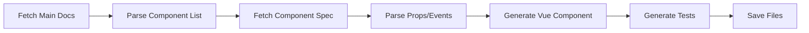

# Quick Start Guide

## What's Been Set Up

Your Polaris Vue component library now includes:

### ✅ Automated Component Generator

A TypeScript script that automatically generates Vue components from Shopify's Polaris Web Components documentation.

**Location**: `scripts/generate-components.ts`

**Usage**:

```bash
bun run generate
```

### ✅ Testing Infrastructure

- **Framework**: Vitest with happy-dom
- **Test Utils**: @vue/test-utils for Vue component testing
- **Configuration**: `vitest.config.ts`

**Usage**:

```bash
bun run test           # Watch mode
bun run test --run     # Single run
bun run test:ui        # UI mode
```

### ✅ Component Structure

All components follow this structure:

```
src/components/
└── [category]/              # actions, media, forms, etc.
    └── S[ComponentName]/    # SButton, SAvatar, etc.
        ├── index.vue        # Vue wrapper
        ├── [name].md        # Documentation (auto-generated)
        └── tests/
            └── S[ComponentName].test.ts
```

### ✅ Example Component

`SButton` is fully set up as an example:

- Located at: `src/components/actions/SButton/`
- Has full TypeScript types
- Has 5 passing tests
- Used in `src/App.vue`

### ✅ Custom Element Configuration

Both Vite and Vitest are configured to recognize `s-*` tags as custom elements (Polaris Web Components).

## How It Works

### 1. Component Generation Process



The generator:

1. Fetches `https://shopify.dev/docs/api/app-home/polaris-web-components.md`
2. Extracts component links (e.g., Button, Avatar, TextField)
3. For each component:
   - Fetches its markdown documentation
   - Parses tables to extract props, events, and slots
   - Generates a Vue wrapper component with TypeScript
   - Creates a Vitest test file
   - Saves the original markdown

### 2. Generated Component Pattern

Each generated component:

- Wraps a Polaris web component (e.g., `<s-button>`)
- Provides TypeScript types for props
- Forwards all events to parent
- Supports default slot for content

Example:

```vue
<template>
  <s-button
    :variant="variant"
    :disabled="disabled"
    @click="$emit('click', $event)"
  >
    <slot />
  </s-button>
</template>

<script setup lang="ts">
interface Props {
  variant?: "primary" | "secondary" | "tertiary";
  disabled?: boolean;
}

defineProps<Props>();

defineEmits<{
  click: [event: MouseEvent];
}>();
</script>
```

## Next Steps

### 1. Run the Generator

Generate all Polaris components:

```bash
bun run generate
```

**Note**: This will fetch from Shopify's servers. The script handles errors gracefully if a component fails.

### 2. Review Generated Components

After generation, review:

- Component files in `src/components/`
- Test files to ensure coverage
- TypeScript types for accuracy

### 3. Customize as Needed

You may want to:

- Add validation logic
- Enhance type definitions
- Add computed properties
- Extend functionality

### 4. Run Tests

Ensure all generated components work:

```bash
bun run test --run
```

### 5. Use in Your App

Import and use components:

```vue
<script setup lang="ts">
import SButton from "@/components/actions/SButton/index.vue";
import STextField from "@/components/forms/STextField/index.vue";
</script>

<template>
  <div>
    <STextField v-model="email" label="Email" />
    <SButton variant="primary" @click="submit">Submit</SButton>
  </div>
</template>
```

## Development Workflow

### Adding a New Component Manually

1. Create directory structure:

   ```bash
   mkdir -p src/components/[category]/S[Name]/tests
   ```

2. Create `index.vue`:

   - Follow the pattern in `SButton/index.vue`
   - Add TypeScript types
   - Forward events

3. Create test file:

   - Follow the pattern in `SButton/tests/SButton.test.ts`
   - Test props, events, and rendering

4. Run tests:
   ```bash
   bun run test
   ```

### Updating an Existing Component

1. Modify the component file
2. Update tests if needed
3. Run tests to verify:
   ```bash
   bun run test [path-to-component-test]
   ```

## Scripts Reference

| Command              | Description                           |
| -------------------- | ------------------------------------- |
| `bun run dev`        | Start development server              |
| `bun run build`      | Build for production                  |
| `bun run preview`    | Preview production build              |
| `bun run test`       | Run tests in watch mode               |
| `bun run test --run` | Run tests once                        |
| `bun run test:ui`    | Run tests with UI                     |
| `bun run generate`   | Generate components from Polaris docs |

## Project Structure

```
polaris-vue/
├── docs/                              # Documentation
│   ├── QUICK_START.md                 # This file
│   └── CURSOR_AGENT_INTEGRATION.md    # Future AI integration plans
├── scripts/                           # Build and generation scripts
│   ├── generate-components.ts         # Main generator script
│   └── README.md                      # Generator documentation
├── src/                               # Source code
│   ├── components/                    # Vue components
│   │   ├── actions/                   # Action components
│   │   │   └── SButton/
│   │   ├── media/                     # Media components
│   │   ├── forms/                     # Form components (to be generated)
│   │   └── ...                        # Other categories
│   ├── App.vue                        # Demo app
│   └── main.ts                        # Entry point
├── index.html                         # HTML entry
├── vite.config.ts                     # Vite configuration
├── vitest.config.ts                   # Test configuration
├── tsconfig.json                      # TypeScript config
└── package.json                       # Dependencies and scripts
```

## Troubleshooting

### Tests Failing

```bash
# Clear cache and reinstall
rm -rf node_modules bun.lock
bun install
bun run test
```

### Generator Issues

If the generator fails:

1. Check your internet connection
2. Verify Shopify's documentation is accessible
3. Check console output for specific errors
4. Try generating one component at a time (modify the script)

### TypeScript Errors

```bash
# Rebuild TypeScript declarations
bun run build
```

### Import Errors

Make sure you're using the correct path:

```typescript
// ✅ Correct
import SButton from "@/components/actions/SButton/index.vue";

// ❌ Wrong
import SButton from "@/components/actions/SButton.vue";
```

## Resources

- **Main README**: [../README.md](../README.md)
- **Generator Docs**: [../scripts/README.md](../scripts/README.md)
- **Cursor Agent Integration**: [CURSOR_AGENT_INTEGRATION.md](./CURSOR_AGENT_INTEGRATION.md)
- **Polaris Docs**: https://shopify.dev/docs/api/app-home/polaris-web-components
- **Vue 3 Docs**: https://vuejs.org/
- **Vitest Docs**: https://vitest.dev/

## Questions?

Check the documentation files listed above, or review the example `SButton` component to understand the pattern.
